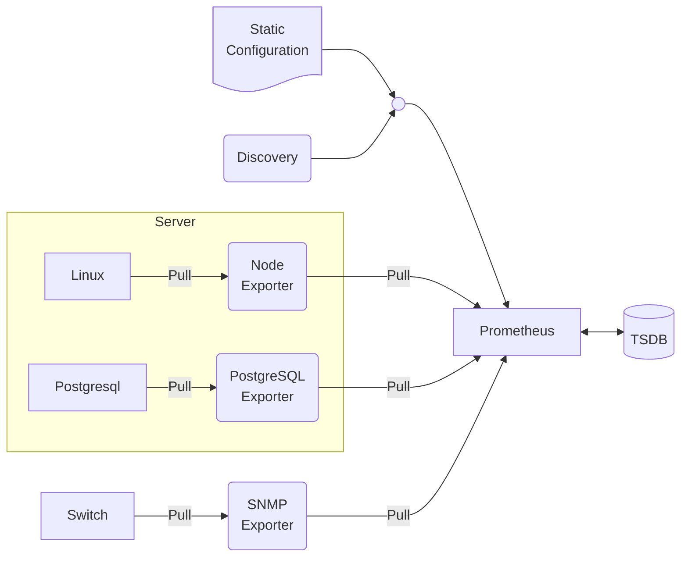

# Ingesting SNMP data into Elasticsearch

<div class="absolute bottom-0 left-0 right-0 p-2 text-sm">
  SNMP: Simple Network Management Protocol
</div>

---

# What is SNMP?

- A standardised protocol used for monitoring and managing network devices like routers, switches, servers, and printers.
- Enables administrators to remotely collect information about device status, performance, and configuration.
- Works by allowing management systems to query devices for specific information using a request-response model.
- Consists of three key components: managers (monitoring stations), agents (software on managed devices), and the Management Information Base (MIB).
- Has evolved through versions v1, v2c, v3 with v3 adding important security features like strong authentication and encryption.

<div class="absolute bottom-0 left-0 right-0 p-2 text-sm">
  <b>Out of Scope:</b> SNMP Traps<br>
  <b>Further Reading:</b> <a href="https://mwl.io/nonfiction/networking#networknomicon">The Networknomicon, or SNMP Mastery</a> by Michael W Lucas
</div>

---

# SNMP data - OIDs


```
1.3.6.1.2.1.1.1.0 = STRING: "Cisco IOS Software, C3560 Software (C3560-IPSERVICESK9-M), Version 15.0(2)SE, RELEASE SOFTWARE (fc1)"
1.3.6.1.2.1.1.3.0 = Timeticks: (1234567) 3:25:45.67
1.3.6.1.2.1.1.4.0 = STRING: "admin@example.com"
1.3.6.1.2.1.1.5.0 = STRING: "core-switch-01"
1.3.6.1.2.1.1.6.0 = STRING: "Server Room 3, Rack 5"
1.3.6.1.2.1.2.2.1.2.1 = STRING: "GigabitEthernet1/0/1"
1.3.6.1.2.1.2.2.1.8.1 = INTEGER: 1
1.3.6.1.2.1.2.2.1.10.1 = Counter32: 3421675928
1.3.6.1.2.1.2.2.1.16.1 = Counter32: 2750092745
1.3.6.1.2.1.4.20.1.1.192.168.1.1 = IpAddress: 192.168.1.1
```

---

# SNMP data - MIBs

```
SNMPv2-MIB::sysDescr.0 = STRING: "Cisco IOS Software, C3560 Software (C3560-IPSERVICESK9-M), Version 15.0(2)SE, RELEASE SOFTWARE (fc1)"
SNMPv2-MIB::sysUpTime.0 = Timeticks: (1234567) 3:25:45.67
SNMPv2-MIB::sysContact.0 = STRING: "admin@example.com"
SNMPv2-MIB::sysName.0 = STRING: "core-switch-01"
SNMPv2-MIB::sysLocation.0 = STRING: "Server Room 3, Rack 5"
IF-MIB::ifDescr.1 = STRING: "GigabitEthernet1/0/1"
IF-MIB::ifOperStatus.1 = INTEGER: up(1)
IF-MIB::ifInOctets.1 = Counter32: 3421675928
IF-MIB::ifOutOctets.1 = Counter32: 2750092745
IP-MIB::ipAdEntAddr.192.168.1.1 = IpAddress: 192.168.1.1
```

---

# SNMP security

- SNMP implementations below v3 are plain text only.
- The IETF released SNMPv1 in 1988. The IETF released SNMPv3 in 1998.
- Historically, the code quality of SNMP agent implementations has been a cause for concern.
- SNMPv3 configuration is complex and arcane.
- Best practice is ___still___ to make certain SNMP Agents are only presented on a dedicated management network.
- Vendors have been gradually deprecating the management features of SNMP, often in favour of NEOCON/YANG, but maintaining SNMP for read-only metrics.

<div class="absolute bottom-0 left-0 right-0 p-2 text-sm">
  <b>2002 Security Hole in SNMP:</b> https://it.slashdot.org/story/02/02/12/1936224/security-hole-in-snmp<br>
  <b>CISA Recommendations:</b> https://www.cisa.gov/news-events/alerts/2017/06/05/reducing-risk-snmp-abuse<br>
  <b>NCSC Recommendations:</b> https://www.ncsc.gov.uk/blog-post/protect-your-management-interfaces<br>
  <b>NETCONF + YANG:</b> https://packetpushers.net/blog/using-netconf-yang-to-configure-network-devices-and-why-it-does-not-replace-snmp/
</div>

---

# Best practices regarding SNMP security

- Wherever supported use SNMPv3.
- Use dedicated read-only credentials.
- Keep all SNMP traffic within the originating security zone.

---

# The SNMP monitoring software landscape

## Commercial
- Openview
- Solarwinds
- IBM Netcool Operations Insight

## Open source
- Cacti
- Zabbix
- Prometheus

<div class="absolute bottom-0 left-0 right-0 p-2 text-sm">
  <b>Openview Ownership:</b> HP (Hewlett-Packard) → HPE (Hewlett Packard Enterprise) → Micro Focus (RIP) → OpenText<br>
  <b>Solarwinds supply chain attack:</b> https://www.cisecurity.org/solarwinds<br>
  <b>IBM acquires Micromuse: </b> https://www.cnet.com/tech/services-and-software/ibm-to-acquire-micromuse-for-865-million/
</div>

---

---
layout: center
---

# Prometheus



---


