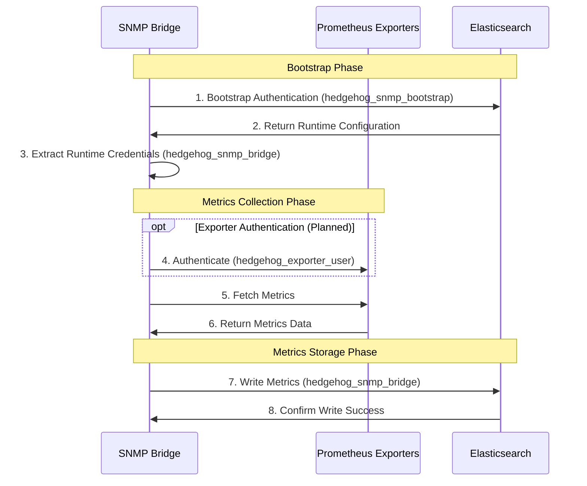

# Access Control Model for SNMP Bridge

This document illustrates the access control model for the Elasticsearch SNMP Bridge, showing all authentication points and permissions.

## Role-Based Access Control (RBAC) Diagram

```
┌──────────────────────────────────────────────────────────────────────────────────────────────────────────┐
│                                     SNMP Bridge Access Control Model                                      │
└──────────────────────────────────────────────────────────────────────────────────────────────────────────┘
                                                    │
                     ┌──────────────────────────────┼──────────────────────────────┐
                     │                              │                              │
                     ▼                              ▼                              ▼
┌──────────────────────────────────┐ ┌──────────────────────────────┐ ┌──────────────────────────────┐
│        Prometheus Exporters      │ │      Elasticsearch (Config)   │ │     Elasticsearch (Metrics)  │
│        Authentication            │ │      Authentication            │ │     Authentication           │
└──────────────────────────────────┘ └──────────────────────────────┘ └──────────────────────────────┘
              │                                    │                              │
              │                                    │                              │
              ▼                                    ▼                              ▼
┌──────────────────────────────────┐ ┌──────────────────────────────┐ ┌──────────────────────────────┐
│ ┌────────────────────────────┐   │ │ ┌────────────────────────┐   │ │ ┌────────────────────────┐   │
│ │      Exporter Users        │   │ │ │   Bootstrap User       │   │ │ │    Metrics User        │   │
│ │                            │   │ │ │                        │   │ │ │                        │   │
│ │  • hedgehog_exporter_user  │   │ │ │  • hedgehog_snmp_      │   │ │ │  • hedgehog_snmp_      │   │
│ │    (Optional)              │   │ │ │    bootstrap           │   │ │ │    bridge              │   │
│ └────────────────────────────┘   │ │ └────────────────────────┘   │ │ └────────────────────────┘   │
│              │                    │ │              │                │ │              │                │
│              ▼                    │ │              ▼                │ │              ▼                │
│ ┌────────────────────────────┐   │ │ ┌────────────────────────┐   │ │ ┌────────────────────────┐   │
│ │      Exporter Roles        │   │ │ │   Bootstrap Role       │   │ │ │    Metrics Role        │   │
│ │                            │   │ │ │                        │   │ │ │                        │   │
│ │  • Basic authentication    │   │ │ │  • snmp_bridge_        │   │ │ │  • snmp_bridge_role    │   │
│ │    for HTTP endpoints      │   │ │ │    bootstrap_role      │   │ │ │                        │   │
│ └────────────────────────────┘   │ │ └────────────────────────┘   │ │ └────────────────────────┘   │
│              │                    │ │              │                │ │              │                │
│              ▼                    │ │              ▼                │ │              ▼                │
│ ┌────────────────────────────┐   │ │ ┌────────────────────────┐   │ │ ┌────────────────────────┐   │
│ │    Exporter Permissions    │   │ │ │   Bootstrap Permissions │   │ │ │   Metrics Permissions  │   │
│ │                            │   │ │ │                        │   │ │ │                        │   │
│ │  • Access to metrics       │   │ │ │  • cluster: monitor    │   │ │ │  • cluster: monitor    │   │
│ │    endpoints               │   │ │ │  • indices:            │   │ │ │  • indices:            │   │
│ │  • No write access needed  │   │ │ │    - .snmp-bridge-     │   │ │ │    - snmp-metrics-*:   │   │
│ │                            │   │ │ │      config: read,     │   │ │ │      write, read,      │   │
│ │                            │   │ │ │      view_index_       │   │ │ │      view_index_       │   │
│ │                            │   │ │ │      metadata          │   │ │ │      metadata          │   │
│ └────────────────────────────┘   │ │ └────────────────────────┘   │ │ └────────────────────────┘   │
└──────────────────────────────────┘ └──────────────────────────────┘ └──────────────────────────────┘
```

## Access Control Matrix

| User                    | Resource                   | Permissions                      | Purpose                           |
|-------------------------|----------------------------|----------------------------------|-----------------------------------|
| hedgehog_snmp_bootstrap | .snmp-bridge-config        | read, view_index_metadata        | Read runtime configuration        |
| hedgehog_snmp_bootstrap | snmp-metrics-*             | none                             | No metrics access needed          |
| hedgehog_snmp_bootstrap | cluster                    | monitor                          | Basic cluster health monitoring   |
| hedgehog_snmp_bridge    | .snmp-bridge-config        | none                             | No config access needed           |
| hedgehog_snmp_bridge    | snmp-metrics-*             | write, read, view_index_metadata | Write metrics data                |
| hedgehog_snmp_bridge    | cluster                    | monitor                          | Basic cluster health monitoring   |
| hedgehog_exporter_user  | Prometheus exporter        | read                             | Access metrics endpoints          |
| (Optional)              | endpoints                  |                                  |                                   |

## Authentication Flow



## Security Considerations

1. **Principle of Least Privilege**:
   - Each user has only the permissions required for its specific function
   - Bootstrap user cannot write metrics
   - Metrics user cannot read configuration
   - Exporter authentication is optional but recommended for secure environments

2. **Credential Isolation**:
   - Bootstrap credentials stored in bootstrap configuration
   - Runtime credentials stored in runtime configuration
   - Exporter credentials stored in runtime configuration
   - Compromise of one set doesn't automatically compromise others

3. **Authentication Methods**:
   - Elasticsearch: Username/password or API key
   - Prometheus exporters: Basic authentication (optional)

4. **TLS Encryption**:
   - All connections to Elasticsearch use TLS
   - Connections to exporters can use TLS if configured

## Implementation Status

| Feature                           | Status      | Notes                                     |
|-----------------------------------|-------------|-------------------------------------------|
| Bootstrap user authentication     | Implemented | Used for reading configuration            |
| Metrics user authentication       | Implemented | Used for writing metrics                  |
| Exporter authentication           | Backlog     | To be implemented in next iteration       |
| TLS for Elasticsearch             | Implemented | Configurable verification                 |
| TLS for exporters                 | Implemented | Optional in exporter configuration        |
